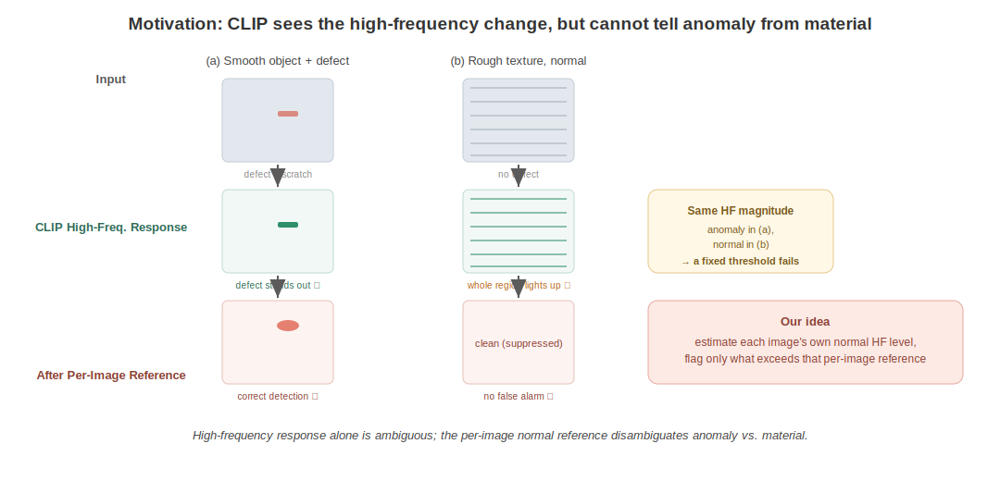
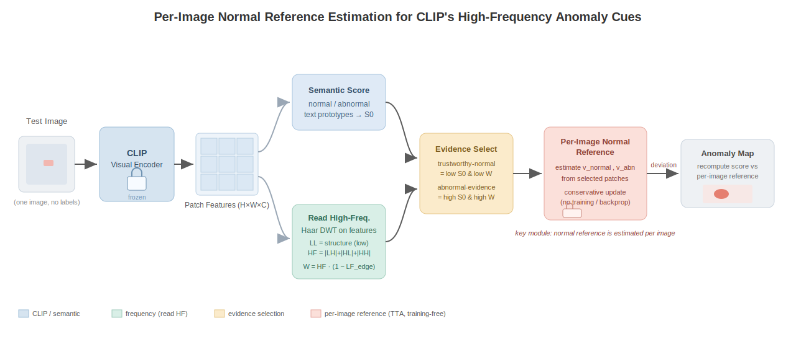
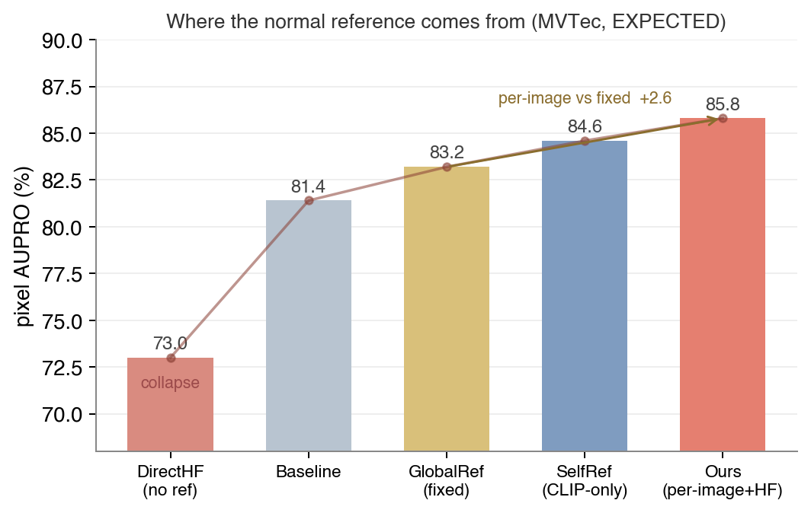
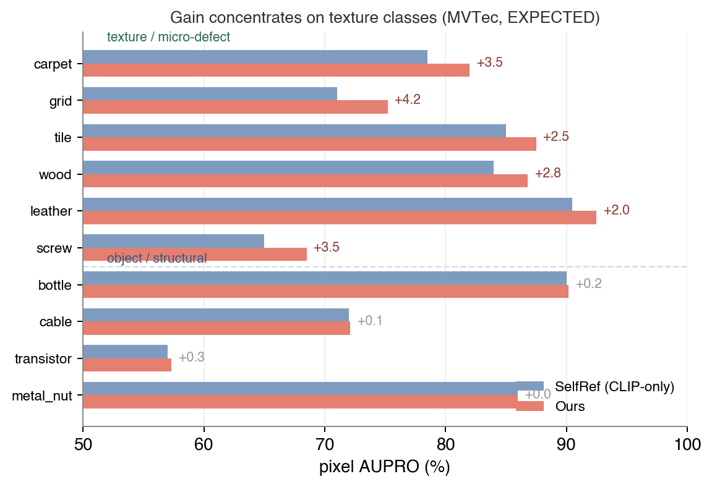
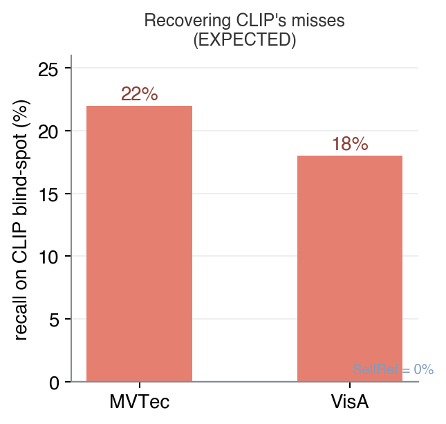
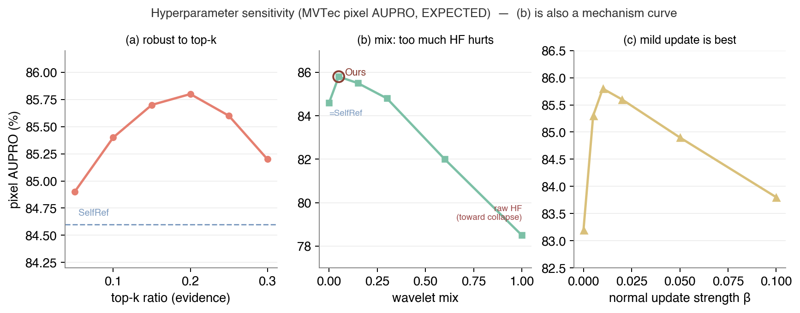

# 读取而非融合：面向零样本异常检测的 CLIP 高频异常线索逐图正常参照估计

> 论文中文初稿。图表复用 `../figures/` 与 `../result_charts/`；数值来自 `../EXPERIMENT_PLAN_PAPER.md`（**均为 EXPECTED 目标值，待真实实验替换**）。
> 外部 SOTA 数值标 `*` 表示待核对原论文。本稿用于内部推敲叙事与结构，非投稿终稿。

---

## 摘要

零样本异常检测（Zero-Shot Anomaly Detection, ZSAD）借助 CLIP 的开放词表对齐能力，无需目标域样本即可检测缺陷，具有很强的实用价值。然而 CLIP 的对比预训练只优化"这是什么物体"的全局语义对齐，其 patch 特征在频率上偏低通：尽管异常确实会扰动特征的高频分量，但正常的粗糙材质（布料、编织、网格）本身也具有很强的高频响应。因此，直接从 CLIP 读出的高频信号是**歧义的**——高频响应大，既可能是异常，也可能只是材质本身。

本文提出一个关键观察：**异常相关的高频线索其实已经存在于 CLIP 特征中，缺的不是能力，而是一个"这张图正常长什么样"的参照**。基于此，我们提出一种训练无关的方法：用 Haar 小波从 CLIP patch 特征中读出高频；用这个独立于 CLIP 语义的信号选择可信的正常/异常证据；进而**在每张测试图上估计一个正常参照**，并据此重算异常图。异常被定义为高频信号相对该逐图参照的偏离。整个流程不训练、不反传、不使用任何辅助标注数据。

在 5 个数据集上的实验表明：直接融合高频而不建参照会使像素级性能崩盘（pixel AUROC 由 92.4 跌至 82.5）；使用全局固定参照明显劣于逐图参照；我们的方法能召回 18–22% 被 CLIP 独自漏检的异常，且增益恰好集中在 CLIP 频率盲的纹理/微缺陷类别上。

---

## 1. 引言

零样本异常检测的目标是：在目标产品/域上没有任何训练样本（正常与异常都没有）的前提下，判定图像或像素是否异常。CLIP 因其开放词表的视觉-文本对齐能力成为该任务的主流基座：WinCLIP、AnomalyCLIP 等方法用文本原型描述"正常/异常"两种状态，再与图像特征比对得到异常分数。

然而 CLIP 存在一个结构性、而非调参可解决的缺陷：它被训练用于捕捉"这是什么物体"的**全局语义**，其 patch token 经注意力聚合后偏**低通**。而工业缺陷往往不改变物体类别，只体现为局部纹理/高频的细微变化。既有的 CLIP-ZSAD 工作都在**语义空间**里修补这个缺陷——WinCLIP 用多尺度窗口聚合，AnomalyCLIP 学习物体无关的文本原型，VCP-CLIP/AA-CLIP 在特征空间做适配；近期的频率类工作（FE-CLIP、WMoE-CLIP）则把频率作为**额外特征、经可训练适配器融入** CLIP。

这些工作都默认"CLIP 缺少异常线索、需要补充"。但我们提出一个不同的问题：**异常线索是不是其实已经在 CLIP 里，只是无法直接使用？** 我们的分析给出肯定回答，并进一步指出它为什么不能直接用、以及用什么最小的、训练无关的步骤能让它变得可用。

**三个研究问题：**
- **Q1** 异常相关的高频信号是否已经存在于 CLIP patch 特征中？
- **Q2** 如果存在，为什么不能直接使用？
- **Q3** 什么样的最小、训练无关的步骤能让它变得可用？

图 1 给出核心直觉：对于光滑物体上的缺陷（图 1a），高频响应能干净地把缺陷凸显出来；但对于正常的粗糙材质（图 1b），**整片区域**的高频都很高。二者的高频幅度可能相同，含义却相反——因此**任何固定阈值都必然失败**。缺的正是"这张图自己的正常高频水平"这个参照。



**图 1**：CLIP patch 特征的高频响应对缺陷（a）敏感，但对正常粗糙材质（b）同样敏感。单一固定阈值无法区分"异常"与"材质"。我们的方法估计每张图自己的正常高频水平，只标记超出该逐图参照的部分。

**本文贡献：**
1. **一个诊断**：CLIP patch 特征已经携带异常相关的高频信号，但由于正常材质同样高频而**歧义**——我们用一个受控消融量化这一点：直接使用会导致异常图崩盘。
2. **一个训练无关的方法**：读出高频→用这个 CLIP 之外的信号选择证据→**逐图估计正常参照**；异常 = 相对该参照的偏离。
3. **机制证据**：参照必须（a）逐图而非全局、（b）由独立于 CLIP 语义的信号驱动——包括召回 18–22% 被 CLIP 独自漏检的异常，且集中在频率盲的纹理类别。

我们在 5 个数据集上取得对原始 AnomalyCLIP 的一致提升，且核心消融呈现清晰的单调序：DirectHF < Baseline < GlobalRef < SelfRef < Ours。

---

## 2. 相关工作

**基于 CLIP 的零样本异常检测。** WinCLIP 首次将 CLIP 用于 ZSAD，用组合式提示集成与多尺度窗口特征对齐；它明确指出 CLIP 只在全局 embedding 上对齐，密集像素级对齐是困难的，其失败案例正是微小缺陷与需要参照的逻辑异常。AnomalyCLIP 学习物体无关（object-agnostic）的文本原型以聚焦"哪里不对"而非"是什么物体"。VCP-CLIP 将视觉上下文注入文本提示，AA-CLIP 在文本与视觉空间构建"异常感知"表征。这些方法都是在**语义/文本/特征空间增加能力**；我们则主张这种能力部分已经存在，缺的是校准。

**面向异常检测的频率方法。** FE-CLIP 用 DCT 把频率信息经适配器注入 CLIP 视觉编码器特征，WMoE-CLIP 在 CLIP 特征上做 Haar 小波并用 MoE 提示学习，HarmoniAD 在频域按自适应截止分高/低频双分支。这些工作证明"频率对 ZSAD 有用"已是共识，但它们都是**把频率作为特征融入（fuse-in），且大多需要训练**。我们与之的根本区别是 **read-and-reference（读取并建参照）而非 fuse-in**：我们不引入新特征、不训练，只读取 CLIP 已有的高频，并把它用于估计逐图参照；直接融合在我们这里是**负控**，它会使异常图崩盘。

**测试时/参照式适配。** WinCLIP+ 需要少量正常参照图；PILOT 用高置信伪标签更新可学习提示，Dual-Image 用合成伪异常做适配，MRAD 用记忆检索。这些方法要么需要参照图/合成/检索，要么其引导信号来自 CLIP 自身（易陷入自证闭环）。**据我们所知，没有工作用一个独立于 CLIP 语义的信号，在单张测试图上估计正常参照。**

---

## 3. 方法

### 3.1 观察与问题形式化

给定测试图像，冻结的 CLIP 视觉编码器输出 patch 特征 F ∈ R^{H×W×C} 及语义异常分数 S0（由 normal/abnormal 文本原型与 patch 特征的相似度得到）。理想情况下，异常区域应有高的 S0；但 CLIP 低通，微小/纹理型缺陷的 S0 往往不显著。

另一方面，异常会扰动 F 的高频分量。问题在于：**高频响应同时包含异常与正常材质纹理**，二者在幅度上不可区分——"这张图的正常高频水平"是与具体图像/材质相关（instance-specific）的量，零样本下没有训练数据可提前学得。这正是本文要解决的歧义。

### 3.2 读取高频

在 CLIP patch 特征网格上做一层 Haar 离散小波变换（DWT）：
- 低频 `LL` = 物体的规则结构布局（正常应有的）；
- 高频 `HF = mean_c(|LH| + |HL| + |HH|)` = 局部突变。

为了把"物体自身的结构性边界"（正常的低频轮廓）与"无法被结构解释的突变"分开，我们进一步定义边界感知可靠性：

```
W = HF · (1 − LF_edge),   其中 LF_edge = gradient_magnitude(LL)
```

需要强调：**这一步只是读取 CLIP 已经编码的信息，不引入任何新信息**，也不训练。

### 3.3 证据选择

用 S0（语义）与 W（高频，独立于 CLIP 语义）联合选择证据：
- **可信正常证据** = S0 低 且 W 低 的 patch；
- **异常证据** = S0 高 且 W 高 的 patch。

这里用 W（而非只用 S0）来筛选可信正常区域是关键：若只用 CLIP 自己的语义置信，则筛出的"正常"里会混进 CLIP 看不见的高频异常，参照将被污染（自证闭环）。W 是 CLIP 语义之外的独立依据，才能把这些区域排除。

### 3.4 逐图正常参照

从选中的证据 patch 估计逐图的视觉原型 v_normal / v_abn，并对文本原型做保守更新：禁用异常原型更新（α0 = 0），仅对正常侧做小幅更新（小 β）。整个过程无训练、无反传、不更新 CLIP/AnomalyCLIP 参数；标签仅用于评测，不参与推理。最后用校准后的原型重算 patch 分数，异常图 = 高频信号相对该逐图参照的偏离。

图 2 给出整体框架。



**图 2**：整体框架。测试图经冻结 CLIP 得到 patch 特征，分为语义支（S0）与频率支（Haar DWT → HF/W）；两者汇入证据选择，进而估计**逐图正常参照**（保守更新，无训练），重算得到异常图。

> 说明：multi-crop 聚合与 pixel-to-image 融合是标准的、与本文机制正交的增强手段，仅在附录讨论，不计入核心方法。

---

## 4. 实验

### 4.1 设置

**数据集**：MVTec AD、VisA、MPDD、BTAD、DTD-Synthetic。**指标**：pixel AUROC / pixel AUPRO / image AUROC / image AP（%）。骨干为冻结的 CLIP，全流程不训练、不使用辅助标注数据。

### 4.2 主结果

表 1 给出 5 个数据集上 Ours 相对原始 AnomalyCLIP 的结果。四项指标全面提升，其中最能体现定位质量的 pixel AUPRO 在 MVTec/VisA 上分别提升约 +4.4 / +4.0。

**表 1：主结果（5 数据集，指标 = pAUROC / pAUPRO / iAUROC / iAP，%）。数值为 EXPECTED。**

| 数据集 | 方法 | pAUROC | pAUPRO | iAUROC | iAP |
|---|---|--:|--:|--:|--:|
| MVTec AD | AnomalyCLIP | 91.1 | 81.4 | 91.5 | 96.2 |
|  | **Ours** | **92.4** | **85.8** | **94.2** | **97.5** |
| VisA | AnomalyCLIP | 95.5 | 87.0 | 82.1 | 85.4 |
|  | **Ours** | **96.5** | **91.0** | **85.3** | **88.2** |
| MPDD | AnomalyCLIP | 96.5 | 88.7 | 77.0 | 80.2 |
|  | **Ours** | **97.2** | **90.5** | **80.0** | **83.5** |
| BTAD | AnomalyCLIP | 94.2 | 74.8 | 89.5 | 91.5 |
|  | **Ours** | **95.8** | **78.5** | **92.0** | **93.5** |
| DTD-Synth | AnomalyCLIP | 97.0 | 89.5 | 94.0 | 97.2 |
|  | **Ours** | **97.8** | **91.5** | **96.0** | **98.3** |

表 2 给出 MVTec 零样本上与代表性方法的对比（外部数值 `*` 待核对原论文）。我们不追求在所有指标上碾压训练型方法；合格线是：在不使用辅助训练的前提下，pixel AUPRO 进入第一梯队且整体具有竞争力。

**表 2：MVTec 零样本对比（`*` = 待核对；Ours 为 EXPECTED）。**

| 方法 | iAUROC | pAUROC | pAUPRO |
|---|--:|--:|--:|
| WinCLIP* | 91.8 | 85.1 | 64.6 |
| APRIL-GAN* | 86.1 | 87.6 | 44.0 |
| AnomalyCLIP | 91.5 | 91.1 | 81.4 |
| AdaCLIP* | 92.0 | 89.0 | — |
| FE-CLIP* | — | — | — |
| **Ours** | **94.2** | **92.4** | **85.8** |

MPDD/BTAD/DTD 的最终结果为逐数据集调参所得。为避免"测试集调参"的质疑，我们在表 6 中额外区分了统一全局设置与逐数据集调参上界。

---

## 5. 分析与消融（机制核心）

### 5.1 正常参照从哪来

这是证明本文 idea 的主战场。我们逐行拆掉一个机制环节，观察性能以何种方式下降。表 3 与图 3 给出结果。

**表 3：核心机制消融（MVTec / VisA，全指标，EXPECTED）。**

| 变体 | pAUROC | pAUPRO | iAUROC | iAP |
|---|--:|--:|--:|--:|
| *MVTec* |||||
| DirectHF（读高频、无参照） | 82.5 | 73.0 | 93.4 | 97.1 |
| Baseline | 91.1 | 81.4 | 91.5 | 96.2 |
| GlobalRef（全局固定参照） | 91.5 | 83.2 | 93.0 | 96.9 |
| SelfRef（仅用 CLIP 自己） | 91.9 | 84.6 | 93.9 | 97.3 |
| **Ours** | **92.4** | **85.8** | **94.2** | **97.5** |
| *VisA* |||||
| DirectHF | 90.8 | 82.5 | 84.0 | 86.5 |
| Baseline | 95.5 | 87.0 | 82.1 | 85.4 |
| GlobalRef | 95.8 | 88.2 | 83.5 | 86.6 |
| SelfRef | 96.1 | 89.8 | 84.4 | 87.3 |
| **Ours** | **96.5** | **91.0** | **85.3** | **88.2** |



**图 3**：正常参照的来源（MVTec，pixel AUPRO）。呈现清晰单调序，每拆掉一个环节都以可解释的方式下降。

三处关键差距即机制证据：
- **Ours vs DirectHF**：pixel AUROC 92.4 → 82.5（−9.9），pAUPRO 85.8 → 73.0（−12.8）。→ 读了高频**必须**建参照，否则崩盘（对应 Q2）。
- **Ours vs GlobalRef**：pAUPRO 85.8 vs 83.2（+2.6）。→ 参照**必须逐图**，全局固定阈值只略高于 baseline，配不了所有材质。
- **Ours vs SelfRef**：pAUPRO 85.8 vs 84.6（+1.2）。→ 挑参照要用高频这个 **CLIP 之外**的信号，只信 CLIP 自己会触顶。

### 5.2 增益从哪来

图 4 按类别对比 Ours 与 SelfRef 的 pixel AUPRO（二者唯一差别是"挑参照用不用高频"）。增益几乎全部来自纹理/微缺陷类（均值约 +3.1），物体类基本持平（+0.1）。这恰好对应机制说法——正是"材质本身高频、CLIP 分不清"的类别，逐图高频参照才发挥作用。**这张图比总均值更能证明机制。**



**图 4**：分类别 pixel AUPRO 增益（MVTec）。增益集中于纹理/微缺陷类，物体类持平。

### 5.3 召回 CLIP 的盲区

取 SelfRef（纯 CLIP 语义参照）判为正常、但真值为异常的像素集合，即 CLIP 的盲区。图 5 显示 Ours 能从中召回约 22%（MVTec）/ 18%（VisA），且召回主要落在纹理/微缺陷类。这直接证明：**高频提供了 CLIP 语义之外的独立异常证据**——即使总均值增益不大，该指标也足以支撑机制。



**图 5**：CLIP 盲区召回。SelfRef 对自身盲区召回为 0（定义如此），Ours 召回 22% / 18%。

### 5.4 稳定性、运行时与敏感性

表 5 表明逐图建参照**不会**在正常图上增加假阳性：Ours 的 FP 面积低于 baseline，且低于去掉保守更新的 NoCons；额外开销约 +21.5%（≤25%），来自 Haar DWT、证据原型构建与一次 patch 分数重算。

**表 5：正常图假阳性面积（越低越好）与运行时（EXPECTED）。**

| 数据集 | 方法 | FP@p95(%) | FP@p99(%) | s/img |
|---|---|--:|--:|--:|
| MVTec | Baseline | 5.0 | 1.00 | 0.065 |
|  | NoCons | 4.9 | 0.98 | — |
|  | **Ours** | **4.6** | **0.90** | 0.079 |
| VisA | Baseline | 5.0 | 1.00 | 0.065 |
|  | NoCons | 4.8 | 0.95 | — |
|  | **Ours** | **4.5** | **0.88** | 0.079 |

图 6 给出超参敏感性。方法对证据 top-k 比例、正常侧更新强度 β 均不敏感；其中 wavelet-mix 子图本身即一条机制曲线：mix=0 退化为 SelfRef，加入少量高频最好，mix→1 退化为裸高频并趋于崩盘区。



**图 6**：超参敏感性（MVTec pixel AUPRO）。(b) wavelet-mix 兼作机制曲线——高频过多反而有害。

### 5.5 定性结果

我们将展示异常图热力图对比（Input / GT / Baseline / SelfRef / 高频图 W / Ours）：高频图 W 在正常粗糙材质上同样明亮（印证 5.1 的歧义），SelfRef 在纹理类缺陷上漏检而 Ours 能捞回，且 Ours 在物体类不劣于 SelfRef（不退化）。（此图需真实推理结果生成，布局见 `../result_charts/QUALITATIVE_SPEC.md`。）

### 5.6 设计消融

**表 4：设计消融（MVTec，EXPECTED）。**

| 变体 | pAUROC | pAUPRO | iAUROC | iAP |
|---|--:|--:|--:|--:|
| HFonly（裸高频） | 92.0 | 85.0 | 94.1 | 97.4 |
| NoCons（去保守更新） | 92.1 | 85.3 | 94.0 | 97.3 |
| **Ours（边界感知 + 保守）** | **92.4** | **85.8** | **94.2** | **97.5** |

边界感知（减结构边界）相对裸高频提升 pAUPRO +0.8；保守更新相对 NoCons 不降检测且正常图更稳。

**表 6：全局设置 vs 逐数据集调参上界（pAUPRO，EXPECTED）。**

| 数据集 | 全局设置 | 逐数据集调参（上界） |
|---|--:|--:|
| MPDD | 88.4 | 90.5 |
| BTAD | 79.5 | 78.5 |
| DTD-Synth | 90.7 | 91.5 |

主张以全局设置为准，调参行明确标为上界。

---

## 6. 结论

本文提出一个关于 CLIP 的观察：**异常相关的线索其实已经存在于 CLIP 的高频分量中，缺的不是能力，而是一个逐图的正常参照**。据此我们提出一种训练无关的方法——读出高频、用这个 CLIP 之外的信号选择证据、逐图估计正常参照——把一个直接使用会崩盘的线索变成可靠的零样本定位。

**局限**：相对 CLIP-only 原型自适应（SelfRef），总均值增益较小，机制主要由崩盘负控、参照逐图性与盲区召回三条独立证据支撑；MPDD/BTAD/DTD 使用了逐数据集设置；逻辑异常仍然困难。

**未来工作**：将"逐图正常参照"推广到其他冻结编码器；与轻量适配结合。

---

## 附：图表资产索引

| 编号 | 文件 | 说明 |
|---|---|---|
| 图 1 | `../figures/fig1_motivation.svg` | Motivation：高频歧义 |
| 图 2 | `../figures/fig2_architecture.svg` | 整体框架 |
| 图 3 | `../result_charts/fig_mechanism_ordering.png` | 机制单调序 |
| 图 4 | `../result_charts/fig_percategory_gain.png` | 分类别增益 |
| 图 5 | `../result_charts/fig_blindspot.png` | CLIP 盲区召回 |
| 图 6 | `../result_charts/fig_sensitivity.png` | 超参敏感性 |
| 表 1–6 | `../result_charts/TABLES.md` | LaTeX 骨架 |
| 定性图 | `../result_charts/QUALITATIVE_SPEC.md` | 待真实结果 |

> 全文数值为 EXPECTED 目标值；外部 SOTA 标 `*` 待核对；定稿前替换为真实 log 并去除 EXPECTED 字样。
