# 完整模型结构图

该图严格对应 `src/anomalyclip/prototype_adaptation.py` 与最终论文方法：

- 主路径：冻结 AnomalyCLIP → 初始语义概率 → Haar 小波可靠性 → 语义—频谱证据权重 → top-k 逐图视觉原型 → 保守文本原型校准 → 多层语义重打分。
- 可选路径：multi-crop 与 pixel-to-image，仅作为正交评测增强。
- 诊断路径：输出 `S0/HF/LF-edge/W/weights/masks/confidence`，用于机制可视化和消融。
- 负控路径：直接融合 `S0` 与 `W`，明确标注为消融而非主方法。

```mermaid
%%{init: {
  "theme": "base",
  "flowchart": {
    "curve": "basis",
    "htmlLabels": true,
    "nodeSpacing": 30,
    "rankSpacing": 45,
    "padding": 12
  },
  "themeVariables": {
    "fontFamily": "Arial, Helvetica, sans-serif",
    "fontSize": "14px",
    "primaryTextColor": "#24313f",
    "lineColor": "#687684",
    "clusterBkg": "#ffffff",
    "clusterBorder": "#c8d1da"
  }
}}%%

flowchart TB

    subgraph STAGE1["阶段 I：冻结基础模型与双线索提取"]
        direction LR

        subgraph INPUT["1. 输入与冻结的 AnomalyCLIP"]
            direction TB
            IMG["测试图像 x"]
            PROMPT["已学习的物体无关提示<br/>normal / abnormal"]
            VENC["CLIP 视觉编码器<br/>测试时冻结"]
            TENC["CLIP 文本编码器<br/>测试时冻结"]
            MLF["多层 patch 特征 F¹...Fᴸ<br/>与全局图像特征 g"]
            TEXTP["固定文本原型<br/>tₙ, tₐ"]
            IMG --> VENC --> MLF
            PROMPT --> TENC --> TEXTP
        end

        subgraph ANCHOR["2. 锚点 token 与初始语义"]
            direction TB
            SELECT["锚点层选择<br/>last 或多层 mean"]
            TOKENS["去 CLS、L2 归一化<br/>F={fᵢ}, H×W×C"]
            INITLOGIT["余弦相似度 / τ<br/>[〈fᵢ,tₙ〉,〈fᵢ,tₐ〉]"]
            S0["初始异常概率<br/>S₀(i)=softmax(logitsᵢ)ₐ"]
            SELECT --> TOKENS --> INITLOGIT --> S0
        end

        subgraph WAVELET["3. Haar 小波可靠性"]
            direction TB
            GRID["tokens → B×C×H×W<br/>奇数尺寸 replicate padding"]
            HAAR["2×2 Haar 分解<br/>LL, LH, HL, HH"]
            HFLF["HF=mean_c(|LH|+|HL|+|HH|)<br/>LF-edge=||∇LL||"]
            NORM["上采样 + 逐图 p₁–p₉₉<br/>裁剪归一化到 [0,1]"]
            WMODE{"可靠性模式"}
            WHF["HF-only：W=HF"]
            WBOUND["Boundary-aware：<br/>W=HF·(1−LF-edge)<br/>再次逐图归一化"]
            WMAP["频谱可靠性图 W<br/>不是最终异常图"]
            GRID --> HAAR --> HFLF --> NORM --> WMODE
            WMODE -->|hf_only| WHF --> WMAP
            WMODE -->|boundary_aware| WBOUND --> WMAP
        end
    end

    MLF --> SELECT
    TEXTP --> INITLOGIT
    TOKENS --> GRID

    subgraph STAGE2["阶段 II：逐图视觉原型与文本原型校准"]
        direction LR

        subgraph EVIDENCE["4. 语义—频谱证据重加权"]
            direction TB
            SEMW["语义证据<br/>qₐ=S₀^γ<br/>qₙ=(1−S₀)^γ"]
            WAVFACTOR["弱频谱调制<br/>rₐ=(1−λ)+λW<br/>rₙ=(1−λ)+λ(1−W)"]
            WEIGHTS["patch 权重<br/>ωₐ=qₐ·rₐ^η<br/>ωₙ=qₙ·rₙ^η"]
            LZERO["λ=0 → SemanticProto<br/>纯语义逐图原型"]
            SEMW --> WEIGHTS
            WAVFACTOR --> WEIGHTS
            LZERO -.退化关系.-> WEIGHTS
        end

        subgraph VPROTO["5. 逐图视觉原型"]
            direction TB
            TOPK["分别按 ωₐ / ωₙ<br/>选择 top-k patch"]
            VPAIR["加权平均 + L2 归一化<br/>得到 vₐ 与 vₙ"]
            CPAIR["top-k 权重均值<br/>得到 cₐ 与 cₙ"]
            MASKS["诊断：正常/异常<br/>top-k patch 掩码"]
            TOPK --> VPAIR
            TOPK --> CPAIR
            TOPK --> MASKS
        end

        subgraph CALIB["6. 保守文本原型校准"]
            direction TB
            GATE["基础更新门控<br/>m=1[cₐ ≥ update_min_conf]"]
            RATE["候选更新率<br/>α=α₀·cₐ·m<br/>β=β₀·cₙ·m"]
            AGATE["异常原型附加门控<br/>mₐ=1[cₐ ≥ max(τₐ, update_min_conf)]"]
            ASYM["验证配置<br/>α₀=0，β₀ 较小<br/>异常原型保持固定"]
            UPDATE["正常：t̃ₙ=norm((1−β)tₙ+βvₙ)<br/>异常候选：t'ₐ=norm((1−α)tₐ+αvₐ)<br/>t̃ₐ=mₐ·t'ₐ+(1−mₐ)·tₐ"]
            ADAPTED["逐图校准文本原型<br/>t̃ₙ, t̃ₐ"]
            GATE --> RATE
            ASYM --> RATE
            AGATE --> UPDATE
            RATE --> UPDATE --> ADAPTED
        end
    end

    S0 --> SEMW
    WMAP --> WAVFACTOR
    WEIGHTS --> TOPK
    TOKENS --> TOPK
    VPAIR --> UPDATE
    CPAIR --> GATE
    CPAIR --> AGATE
    CPAIR --> RATE
    TEXTP --> UPDATE

    subgraph STAGE3["阶段 III：校准后预测与可选增强"]
        direction LR

        subgraph PRED["7. 校准语义原型重新预测"]
            direction TB
            PERLAYER["每个选定层重新打分<br/>Fˡ × [t̃ₙ,t̃ₐ] / τ"]
            MAPPIPE["softmax 异常概率<br/>→ patch 网格<br/>→ 上采样至图像尺寸"]
            LFUSE["多层融合<br/>sum 或 mean"]
            PIXMAP["最终像素异常图 A(x)"]
            IMGSCORE["全局特征 g × [t̃ₙ,t̃ₐ]<br/>得到图像异常概率"]
            IMAGEOUT["图像级异常分数"]
            PERLAYER --> MAPPIPE --> LFUSE --> PIXMAP
            IMGSCORE --> IMAGEOUT
        end

        subgraph OPTIONAL["8. 正交评测增强（非核心）"]
            direction TB
            MCROP["Multi-crop 异常图融合"]
            P2I["Pixel-to-image top-k 融合"]
            FINALPIX["增强后的像素异常图"]
            FINALIMG["增强后的图像异常分数"]
            MCROP --> FINALPIX
            P2I --> FINALIMG
        end
    end

    MLF --> PERLAYER
    ADAPTED --> PERLAYER
    MLF --> IMGSCORE
    ADAPTED --> IMGSCORE
    PIXMAP -.可选.-> MCROP
    IMAGEOUT -.可选.-> P2I
    PIXMAP -.top-k 像素证据.-> P2I

    subgraph AUX["诊断与负控（均不属于主预测路径）"]
        direction LR
        subgraph DIAG["9. 机制诊断输出"]
            direction TB
            DIAGS["S₀ / HF / LF-edge / W<br/>ωₙ / ωₐ / top-k 掩码<br/>cₙ 与 cₐ"]
            VIZ["机制可视化与消融"]
            DIAGS --> VIZ
        end
        subgraph NEG["负控：直接频率图融合"]
            direction TB
            DIRECT["A_direct=(1−ρ)S₀+ρW"]
            DIRECTOUT["DirectFusion 异常图<br/>仅用于消融"]
            DIRECT --> DIRECTOUT
        end
    end

    S0 -.诊断.-> DIAGS
    HFLF -.诊断.-> DIAGS
    WMAP -.诊断.-> DIAGS
    WEIGHTS -.诊断.-> DIAGS
    MASKS -.诊断.-> DIAGS
    CPAIR -.诊断.-> DIAGS
    S0 -.负控.-> DIRECT
    WMAP -.负控.-> DIRECT

    class IMG,PROMPT inputNode
    class VENC,TENC,MLF,GFEAT,TEXTP frozenNode
    class SELECT,TOKENS,INITLOGIT,S0 semanticNode
    class GRID,HAAR,HFLF,NORM,WMODE,WHF,WBOUND,WMAP waveletNode
    class SEMW,WAVFACTOR,WEIGHTS,LZERO evidenceNode
    class TOPK,VPAIR,CPAIR,MASKS protoNode
    class GATE,RATE,AGATE,ASYM,UPDATE,ADAPTED calibNode
    class PERLAYER,MAPPIPE,LFUSE,PIXMAP,IMGSCORE,IMAGEOUT outputNode
    class MCROP,P2I,FINALPIX,FINALIMG optionalNode
    class DIAGS,VIZ diagnosticNode
    class DIRECT,DIRECTOUT negativeNode

    classDef inputNode fill:#eef2f5,stroke:#8997a5,color:#25313c,stroke-width:1.3px
    classDef frozenNode fill:#dce8f2,stroke:#7395b3,color:#24445f,stroke-width:1.3px
    classDef semanticNode fill:#e6eef7,stroke:#7897b8,color:#29455f,stroke-width:1.3px
    classDef waveletNode fill:#dff1e9,stroke:#6fae94,color:#245b48,stroke-width:1.3px
    classDef evidenceNode fill:#fff1cf,stroke:#d4ad57,color:#6b5016,stroke-width:1.3px
    classDef protoNode fill:#f8ead7,stroke:#c99a62,color:#67431d,stroke-width:1.3px
    classDef calibNode fill:#fae1dc,stroke:#d18476,color:#733a31,stroke-width:1.6px
    classDef outputNode fill:#ece7f5,stroke:#8876ad,color:#453762,stroke-width:1.3px
    classDef optionalNode fill:#f3f3f3,stroke:#a8a8a8,color:#555555,stroke-width:1px,stroke-dasharray:5 3
    classDef diagnosticNode fill:#f2eef8,stroke:#a594bd,color:#55466c,stroke-width:1px,stroke-dasharray:4 3
    classDef negativeNode fill:#fde9e7,stroke:#c95f55,color:#7a2d27,stroke-width:1.3px,stroke-dasharray:6 3

    style INPUT fill:#fbfcfd,stroke:#aab6c1,stroke-width:1px
    style ANCHOR fill:#fbfcfe,stroke:#9db2c7,stroke-width:1px
    style WAVELET fill:#fbfefc,stroke:#93c3ad,stroke-width:1px
    style EVIDENCE fill:#fffdf7,stroke:#dcc17e,stroke-width:1px
    style VPROTO fill:#fffcf7,stroke:#d9b88c,stroke-width:1px
    style CALIB fill:#fff9f8,stroke:#dba59c,stroke-width:1.5px
    style PRED fill:#fcfbfe,stroke:#aaa0c3,stroke-width:1px
    style OPTIONAL fill:#fcfcfc,stroke:#b8b8b8,stroke-width:1px,stroke-dasharray:5 3
    style DIAG fill:#fcfbfe,stroke:#b4a9c7,stroke-width:1px,stroke-dasharray:4 3
    style NEG fill:#fffafa,stroke:#d78d86,stroke-width:1px,stroke-dasharray:6 3
    style STAGE1 fill:#ffffff,stroke:#98a9b8,stroke-width:1.4px
    style STAGE2 fill:#ffffff,stroke:#c2a46d,stroke-width:1.4px
    style STAGE3 fill:#ffffff,stroke:#9285ae,stroke-width:1.4px
    style AUX fill:#ffffff,stroke:#b6abbf,stroke-width:1.2px,stroke-dasharray:5 3
```

