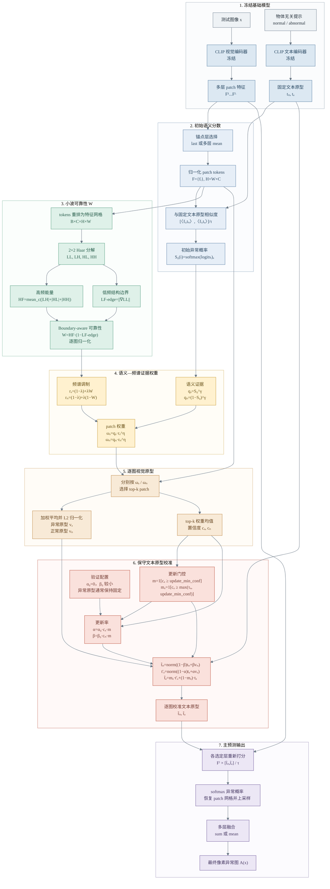

# 核心模型结构图

该图只保留主预测路径：冻结基础模型、初始语义分数、小波可靠性、证据权重、逐图视觉原型、保守文本原型校准和最终像素异常图。它去除了可选增强、诊断输出和 DirectFusion 负控，适合放入正文方法部分。

```mermaid
%%{init: {
  "theme": "base",
  "flowchart": {
    "curve": "basis",
    "htmlLabels": true,
    "nodeSpacing": 34,
    "rankSpacing": 48,
    "padding": 14
  },
  "themeVariables": {
    "fontFamily": "Arial, Helvetica, sans-serif",
    "fontSize": "15px",
    "primaryTextColor": "#24313f",
    "lineColor": "#687684",
    "clusterBkg": "#ffffff",
    "clusterBorder": "#c8d1da"
  }
}}%%

flowchart TB

    subgraph A["1. 冻结基础模型"]
        direction LR
        X["测试图像 x"]
        P["物体无关提示<br/>normal / abnormal"]
        VE["CLIP 视觉编码器<br/>冻结"]
        TE["CLIP 文本编码器<br/>冻结"]
        F["多层 patch 特征<br/>F¹...Fᴸ"]
        T["固定文本原型<br/>tₙ, tₐ"]
        X --> VE --> F
        P --> TE --> T
    end

    subgraph B["2. 初始语义分数"]
        direction TB
        ANCHOR["锚点层选择<br/>last 或多层 mean"]
        TOK["归一化 patch tokens<br/>F={fᵢ}, H×W×C"]
        LOGIT["与固定文本原型相似度<br/>[〈fᵢ,tₙ〉,〈fᵢ,tₐ〉]/τ"]
        S0["初始异常概率<br/>S₀(i)=softmax(logitsᵢ)ₐ"]
        ANCHOR --> TOK --> LOGIT --> S0
    end

    subgraph C["3. 小波可靠性 W"]
        direction TB
        GRID["tokens 重排为特征网格<br/>B×C×H×W"]
        HAAR["2×2 Haar 分解<br/>LL, LH, HL, HH"]
        HF["高频能量<br/>HF=mean_c(|LH|+|HL|+|HH|)"]
        LFE["低频结构边界<br/>LF-edge=||∇LL||"]
        W["Boundary-aware 可靠性<br/>W=HF·(1−LF-edge)<br/>逐图归一化"]
        GRID --> HAAR
        HAAR --> HF
        HAAR --> LFE
        HF --> W
        LFE --> W
    end

    subgraph D["4. 语义—频谱证据权重"]
        direction TB
        QS["语义证据<br/>qₐ=S₀^γ<br/>qₙ=(1−S₀)^γ"]
        RS["频谱调制<br/>rₐ=(1−λ)+λW<br/>rₙ=(1−λ)+λ(1−W)"]
        OM["patch 权重<br/>ωₐ=qₐ·rₐ^η<br/>ωₙ=qₙ·rₙ^η"]
        QS --> OM
        RS --> OM
    end

    subgraph E["5. 逐图视觉原型"]
        direction TB
        TOPK["分别按 ωₐ / ωₙ<br/>选择 top-k patch"]
        PROTO["加权平均并 L2 归一化<br/>异常原型 vₐ<br/>正常原型 vₙ"]
        CONF["top-k 权重均值<br/>置信度 cₐ, cₙ"]
        TOPK --> PROTO
        TOPK --> CONF
    end

    subgraph G["6. 保守文本原型校准"]
        direction TB
        GATE["更新门控<br/>m=1[cₐ ≥ update_min_conf]<br/>mₐ=1[cₐ ≥ max(τₐ, update_min_conf)]"]
        RATE["更新率<br/>α=α₀·cₐ·m<br/>β=β₀·cₙ·m"]
        ASYM["验证配置<br/>α₀=0，β₀ 较小<br/>异常原型通常保持固定"]
        UPDATE["t̃ₙ=norm((1−β)tₙ+βvₙ)<br/>t'ₐ=norm((1−α)tₐ+αvₐ)<br/>t̃ₐ=mₐ·t'ₐ+(1−mₐ)·tₐ"]
        TP["逐图校准文本原型<br/>t̃ₙ, t̃ₐ"]
        GATE --> RATE
        ASYM --> RATE
        RATE --> UPDATE --> TP
        GATE --> UPDATE
    end

    subgraph H["7. 主预测输出"]
        direction TB
        RELAYER["各选定层重新打分<br/>Fˡ × [t̃ₙ,t̃ₐ] / τ"]
        PMAP["softmax 异常概率<br/>恢复 patch 网格并上采样"]
        FUSE["多层融合<br/>sum 或 mean"]
        OUT["最终像素异常图 A(x)"]
        RELAYER --> PMAP --> FUSE --> OUT
    end

    F --> ANCHOR
    T --> LOGIT
    TOK --> GRID
    S0 --> QS
    W --> RS
    OM --> TOPK
    TOK --> TOPK
    PROTO --> UPDATE
    CONF --> GATE
    CONF --> RATE
    T --> UPDATE
    F --> RELAYER
    TP --> RELAYER

    class X,P inputNode
    class VE,TE,F,T frozenNode
    class ANCHOR,TOK,LOGIT,S0 semanticNode
    class GRID,HAAR,HF,LFE,W waveletNode
    class QS,RS,OM evidenceNode
    class TOPK,PROTO,CONF protoNode
    class GATE,RATE,ASYM,UPDATE,TP calibNode
    class RELAYER,PMAP,FUSE,OUT outputNode

    classDef inputNode fill:#eef2f5,stroke:#8997a5,color:#25313c,stroke-width:1.3px
    classDef frozenNode fill:#dce8f2,stroke:#7395b3,color:#24445f,stroke-width:1.3px
    classDef semanticNode fill:#e6eef7,stroke:#7897b8,color:#29455f,stroke-width:1.3px
    classDef waveletNode fill:#dff1e9,stroke:#6fae94,color:#245b48,stroke-width:1.3px
    classDef evidenceNode fill:#fff1cf,stroke:#d4ad57,color:#6b5016,stroke-width:1.3px
    classDef protoNode fill:#f8ead7,stroke:#c99a62,color:#67431d,stroke-width:1.3px
    classDef calibNode fill:#fae1dc,stroke:#d18476,color:#733a31,stroke-width:1.6px
    classDef outputNode fill:#ece7f5,stroke:#8876ad,color:#453762,stroke-width:1.3px

    style A fill:#fbfcfd,stroke:#aab6c1,stroke-width:1px
    style B fill:#fbfcfe,stroke:#9db2c7,stroke-width:1px
    style C fill:#fbfefc,stroke:#93c3ad,stroke-width:1px
    style D fill:#fffdf7,stroke:#dcc17e,stroke-width:1px
    style E fill:#fffcf7,stroke:#d9b88c,stroke-width:1px
    style G fill:#fff9f8,stroke:#dba59c,stroke-width:1.5px
    style H fill:#fcfbfe,stroke:#aaa0c3,stroke-width:1px
```
