# Rich Horizontal Mermaid Architecture

This is a wide horizontal Mermaid version with content richness close to the vertical complete diagram. It preserves the full core path: frozen CLIP/AnomalyCLIP, semantic score, Haar wavelet reliability, evidence weights, per-image visual prototypes, conservative text calibration, and final calibrated prediction.

```mermaid
%%{init: {
  "theme": "base",
  "flowchart": {
    "curve": "basis",
    "htmlLabels": true,
    "nodeSpacing": 34,
    "rankSpacing": 56,
    "padding": 18
  },
  "themeVariables": {
    "fontFamily": "Arial, Helvetica, sans-serif",
    "fontSize": "14px",
    "primaryTextColor": "#24313f",
    "lineColor": "#687684",
    "clusterBkg": "#ffffff",
    "clusterBorder": "#c8d1da"
  }
}}%%

flowchart LR
    %% ===================== Frozen inputs =====================
    subgraph INPUT["1. Frozen AnomalyCLIP inputs"]
        direction TB
        IMG["Test image x"]
        PROMPT["object-agnostic prompts<br/>normal / abnormal"]
        VENC["CLIP visual encoder<br/>frozen"]
        TENC["CLIP text encoder<br/>frozen"]
        MLF["multi-layer patch features<br/>F1, F2, ..., FL"]
        GFEAT["global image feature g"]
        TEXTP["fixed text prototypes<br/>t_n, t_a"]

        IMG --> VENC
        VENC --> MLF
        VENC --> GFEAT
        PROMPT --> TENC
        TENC --> TEXTP
    end

    %% ===================== Semantic branch =====================
    subgraph SEM["2. Semantic cue"]
        direction TB
        SELECT["anchor layer selection<br/>last or multi-layer mean"]
        TOKENS["spatial patch tokens<br/>remove CLS, normalize<br/>F={f_i}, H x W x C"]
        LOGITS["prototype logits<br/>[<f_i,t_n>, <f_i,t_a>] / tau"]
        S0["initial anomaly probability<br/>S0(i)=softmax(logits_i)_a"]

        SELECT --> TOKENS --> LOGITS --> S0
    end

    %% ===================== Wavelet branch =====================
    subgraph WAV["3. Haar wavelet reliability"]
        direction TB
        GRID["reshape tokens to feature grid<br/>B x C x H x W<br/>replicate padding if needed"]
        HAAR["2 x 2 Haar decomposition<br/>LL, LH, HL, HH"]
        HF["high-frequency energy<br/>HF=mean_c(|LH|+|HL|+|HH|)"]
        LFEDGE["low-frequency structure edge<br/>LF-edge=||grad LL||"]
        UPSAMPLE["bilinear upsample<br/>back to H x W"]
        PNORM["per-image percentile clip<br/>p1-p99 -> [0,1]"]
        MODE{"wavelet mode"}
        HFONLY["HF-only<br/>W = HF"]
        BOUND["boundary-aware<br/>W = HF * (1 - LF-edge)<br/>then normalize again"]
        WMAP["spectral reliability map W<br/>reliability only, not final score"]

        GRID --> HAAR
        HAAR --> HF
        HAAR --> LFEDGE
        HF --> UPSAMPLE
        LFEDGE --> UPSAMPLE
        UPSAMPLE --> PNORM
        PNORM --> MODE
        MODE -->|hf_only| HFONLY --> WMAP
        MODE -->|boundary_aware| BOUND --> WMAP
    end

    %% ===================== Evidence weighting =====================
    subgraph EVID["4. Semantic-spectral evidence weighting"]
        direction TB
        QSEM["semantic evidence<br/>q_a = S0^gamma<br/>q_n = (1 - S0)^gamma"]
        RWAV["weak spectral modulation<br/>r_a = (1-lambda)+lambda W<br/>r_n = (1-lambda)+lambda(1-W)"]
        WEIGHT["patch evidence weights<br/>omega_a = q_a * r_a^eta<br/>omega_n = q_n * r_n^eta"]
        SEMPROTO["lambda = 0<br/>SemanticProto"]

        QSEM --> WEIGHT
        RWAV --> WEIGHT
        SEMPROTO -.degenerate case.-> WEIGHT
    end

    %% ===================== Visual prototypes =====================
    subgraph PROTO["5. Per-image visual prototypes"]
        direction TB
        TOPA["top-k by omega_a<br/>abnormal evidence patches"]
        TOPN["top-k by omega_n<br/>normal evidence patches"]
        NWA["normalize selected weights<br/>bar_omega_a"]
        NWN["normalize selected weights<br/>bar_omega_n"]
        VA["abnormal visual prototype v_a<br/>weighted patch mean + L2 norm"]
        VN["normal visual prototype v_n<br/>weighted patch mean + L2 norm"]
        CA["abnormal confidence c_a<br/>mean top-k weight"]
        CN["normal confidence c_n<br/>mean top-k weight"]

        TOPA --> NWA --> VA
        TOPN --> NWN --> VN
        TOPA --> CA
        TOPN --> CN
    end

    %% ===================== Calibration =====================
    subgraph CAL["6. Conservative text prototype calibration"]
        direction TB
        GATE["base update gate<br/>m = 1[c_a >= update_min_conf]"]
        AGATE["abnormal update gate<br/>m_a = 1[c_a >= max(tau_a, update_min_conf)]"]
        RATE["candidate update rates<br/>alpha = alpha0 * c_a * m<br/>beta = beta0 * c_n * m"]
        ASYM["validated asymmetric setting<br/>alpha0 = 0, beta0 small<br/>abnormal prototype usually fixed"]
        TNCAL["normal prototype<br/>t_n~ = norm((1-beta)t_n + beta v_n)"]
        TACAND["abnormal candidate<br/>t_a' = norm((1-alpha)t_a + alpha v_a)"]
        TACAL["gated abnormal prototype<br/>t_a~ = m_a t_a' + (1-m_a)t_a"]
        ADAPT["per-image calibrated text prototypes<br/>t_n~, t_a~"]

        GATE --> RATE
        ASYM --> RATE
        RATE --> TNCAL
        RATE --> TACAND
        AGATE --> TACAL
        TACAND --> TACAL
        TNCAL --> ADAPT
        TACAL --> ADAPT
    end

    %% ===================== Prediction =====================
    subgraph PRED["7. Calibrated semantic prediction"]
        direction TB
        subgraph PATCHSCORE["Patch score branch"]
            direction TB
            RESCORE["re-score each selected layer<br/>F_l x [t_n~, t_a~] / tau"]
            PMAP["softmax anomaly probability<br/>restore patch grid"]
            UPS["upsample to image size"]
            LFUSE["multi-layer fusion<br/>sum or mean"]
            OUT["pixel anomaly map<br/>A(x)"]
            RESCORE --> PMAP --> UPS --> LFUSE --> OUT
        end
        subgraph IMGSCORE["Image score branch"]
            direction TB
            ILOGIT["global image feature<br/>g x [t_n~, t_a~]"]
            IOUT["image anomaly score<br/>s_img"]
            ILOGIT --> IOUT
        end
    end

    %% ===================== Main cross-block edges =====================
    MLF --> SELECT
    TEXTP --> LOGITS
    TOKENS --> GRID
    S0 --> QSEM
    WMAP --> RWAV
    WEIGHT --> TOPA
    WEIGHT --> TOPN
    TOKENS --> TOPA
    TOKENS --> TOPN
    VA --> TACAND
    VN --> TNCAL
    CA --> GATE
    CA --> AGATE
    CA --> RATE
    CN --> RATE
    TEXTP --> TNCAL
    TEXTP --> TACAND
    TEXTP --> TACAL
    ADAPT --> RESCORE
    MLF --> RESCORE
    GFEAT --> ILOGIT
    ADAPT --> ILOGIT

    %% ===================== Styling =====================
    class IMG,PROMPT inputNode
    class VENC,TENC,MLF,GFEAT,TEXTP frozenNode
    class SELECT,TOKENS,LOGITS,S0 semanticNode
    class GRID,HAAR,HF,LFEDGE,UPSAMPLE,PNORM,MODE,HFONLY,BOUND,WMAP waveletNode
    class QSEM,RWAV,WEIGHT,SEMPROTO evidenceNode
    class TOPA,TOPN,NWA,NWN,VA,VN,CA,CN protoNode
    class GATE,AGATE,RATE,ASYM,TNCAL,TACAND,TACAL,ADAPT calibNode
    class RESCORE,PMAP,UPS,LFUSE,OUT,ILOGIT,IOUT outputNode

    classDef inputNode fill:#eef2f5,stroke:#8997a5,color:#25313c,stroke-width:1.3px
    classDef frozenNode fill:#dce8f2,stroke:#7395b3,color:#24445f,stroke-width:1.3px
    classDef semanticNode fill:#e6eef7,stroke:#7897b8,color:#29455f,stroke-width:1.3px
    classDef waveletNode fill:#dff1e9,stroke:#6fae94,color:#245b48,stroke-width:1.3px
    classDef evidenceNode fill:#fff1cf,stroke:#d4ad57,color:#6b5016,stroke-width:1.3px
    classDef protoNode fill:#f8ead7,stroke:#c99a62,color:#67431d,stroke-width:1.3px
    classDef calibNode fill:#fae1dc,stroke:#d18476,color:#733a31,stroke-width:1.6px
    classDef outputNode fill:#ece7f5,stroke:#8876ad,color:#453762,stroke-width:1.3px

    style INPUT fill:#fbfcfd,stroke:#aab6c1,stroke-width:1px
    style SEM fill:#fbfcfe,stroke:#9db2c7,stroke-width:1px
    style WAV fill:#fbfefc,stroke:#93c3ad,stroke-width:1px
    style EVID fill:#fffdf7,stroke:#dcc17e,stroke-width:1px
    style PROTO fill:#fffcf7,stroke:#d9b88c,stroke-width:1px
    style CAL fill:#fff9f8,stroke:#dba59c,stroke-width:1.5px
    style PRED fill:#fcfbfe,stroke:#aaa0c3,stroke-width:1px
    style PATCHSCORE fill:#fcfbfe,stroke:#aaa0c3,stroke-width:1px
    style IMGSCORE fill:#fcfbfe,stroke:#aaa0c3,stroke-width:1px
```

