# Structure-First Horizontal Mermaid Architecture

This version keeps the model architecture and data flow while omitting most equations. It is intended for paper figures or slides where readability matters more than formula completeness.

```mermaid
%%{init: {
  "theme": "base",
  "flowchart": {
    "curve": "basis",
    "htmlLabels": true,
    "nodeSpacing": 40,
    "rankSpacing": 58,
    "padding": 16
  },
  "themeVariables": {
    "fontFamily": "Arial, Helvetica, sans-serif",
    "fontSize": "15px",
    "primaryTextColor": "#24313f",
    "lineColor": "#687684",
    "clusterBkg": "#ffffff",
    "clusterBorder": "#c8d1da"
  }
}}%%

flowchart LR
    subgraph TEXT["Text branch"]
        direction TB
        PROMPT["Object-agnostic prompts<br/>normal / abnormal"]
        TENC["Frozen CLIP text encoder"]
        TPROTO["Fixed text prototypes<br/>t_n, t_a"]
        PROMPT --> TENC --> TPROTO
    end

    subgraph IMAGE["Image branch"]
        direction TB
        IMG["Test image x"]
        VENC["Frozen CLIP visual encoder"]
        PATCH["Multi-layer patch features<br/>F1 ... FL"]
        GLOBAL["Global image feature<br/>g"]
        IMG --> VENC
        VENC --> PATCH
        VENC --> GLOBAL
    end

    subgraph CUES["Cue extraction"]
        direction TB
        SEM["Semantic cue<br/>patch-text similarity -> S0"]
        WAV["Spectral reliability<br/>Haar DWT on patch features -> W"]
        SEM --> CUEJOIN["Semantic direction + spectral reliability"]
        WAV --> CUEJOIN
    end

    EVID["Evidence weighting<br/>produce omega_a / omega_n"]
    PROTO["Per-image visual prototypes<br/>top-k evidence patches<br/>v_a, v_n and c_a, c_n"]
    CALIB["Conservative text prototype calibration<br/>t_n,t_a + v_n,v_a -> t_n~, t_a~"]
    subgraph OUTS["Calibrated prediction"]
        direction TB
        PATCHOUT["Patch score branch<br/>patch features + t_n~,t_a~<br/>layer fusion -> pixel anomaly map A(x)"]
        IMAGEOUT["Image score branch<br/>global image feature + t_n~,t_a~<br/>image anomaly score s_img"]
    end

    PATCH --> SEM
    TPROTO --> SEM
    PATCH --> WAV
    CUEJOIN --> EVID
    EVID --> PROTO
    PATCH -.patch tokens.-> PROTO
    PROTO --> CALIB
    TPROTO -.fixed prototypes.-> CALIB
    CALIB --> PATCHOUT
    CALIB --> IMAGEOUT
    PATCH -.all selected layers.-> PATCHOUT
    GLOBAL -.global feature.-> IMAGEOUT

    class PROMPT,IMG inputNode
    class TENC,VENC,TPROTO,PATCH,GLOBAL frozenNode
    class SEM semanticNode
    class WAV waveletNode
    class CUEJOIN,EVID evidenceNode
    class PROTO protoNode
    class CALIB calibNode
    class PATCHOUT,IMAGEOUT outputNode

    classDef inputNode fill:#eef2f5,stroke:#8997a5,color:#25313c,stroke-width:1.3px
    classDef frozenNode fill:#dce8f2,stroke:#7395b3,color:#24445f,stroke-width:1.3px
    classDef semanticNode fill:#e6eef7,stroke:#7897b8,color:#29455f,stroke-width:1.3px
    classDef waveletNode fill:#dff1e9,stroke:#6fae94,color:#245b48,stroke-width:1.3px
    classDef evidenceNode fill:#fff1cf,stroke:#d4ad57,color:#6b5016,stroke-width:1.3px
    classDef protoNode fill:#f8ead7,stroke:#c99a62,color:#67431d,stroke-width:1.3px
    classDef calibNode fill:#fae1dc,stroke:#d18476,color:#733a31,stroke-width:1.6px
    classDef outputNode fill:#ece7f5,stroke:#8876ad,color:#453762,stroke-width:1.3px

    style TEXT fill:#fbfcfd,stroke:#aab6c1,stroke-width:1px
    style IMAGE fill:#fbfcfd,stroke:#aab6c1,stroke-width:1px
    style CUES fill:#fbfcff,stroke:#b7c7d9,stroke-width:1px
    style OUTS fill:#fcfbfe,stroke:#aaa0c3,stroke-width:1px
```

