# Main Figure Architecture Draft

This is a paper-facing architecture draft. It keeps the key story: text/image branches, semantic cue and wavelet reliability, evidence construction, per-image prototypes, conservative calibration, and patch/image output branches.

```mermaid
%%{init: {
  "theme": "base",
  "flowchart": {
    "curve": "basis",
    "htmlLabels": true,
    "nodeSpacing": 46,
    "rankSpacing": 62,
    "padding": 16
  },
  "themeVariables": {
    "fontFamily": "Arial, Helvetica, sans-serif",
    "fontSize": "16px",
    "primaryTextColor": "#24313f",
    "lineColor": "#66727f",
    "clusterBkg": "#ffffff",
    "clusterBorder": "#c8d1da"
  }
}}%%

flowchart LR
    subgraph LEFT["Frozen CLIP inputs"]
        direction TB
        subgraph TEXT["Text branch"]
            direction LR
            P["Object-agnostic prompts<br/>normal / abnormal"]
            TE["Frozen text encoder"]
            TP["Fixed text prototypes<br/>t_n, t_a"]
            P --> TE --> TP
        end

        subgraph IMAGE["Image branch"]
            direction LR
            X["Test image"]
            VE["Frozen visual encoder"]
            PF["Patch features"]
            GF["Global image feature"]
            X --> VE --> PF
            VE --> GF
        end
    end

    subgraph CUES["Per-image evidence construction"]
        direction TB
        S0["Semantic cue<br/>patch-text similarity<br/>S0"]
        W["Wavelet reliability<br/>Haar DWT on patch features<br/>W"]
        EW["Evidence weighting<br/>semantic evidence x spectral reliability"]
        SEL["Selected evidence patches<br/>normal evidence / abnormal evidence"]

        S0 --> EW
        W --> EW
        EW --> SEL
    end

    VP["Per-image visual prototypes<br/>v_n, v_a"]
    CAL["Conservative prototype calibration<br/>t_n, t_a + v_n, v_a -> t_n~, t_a~"]

    subgraph OUT["Calibrated prediction"]
        direction TB
        PATCHOUT["Patch score branch<br/>pixel anomaly map"]
        IMAGEOUT["Image score branch<br/>image anomaly score"]
    end

    TP --> S0
    PF --> S0
    PF --> W
    PF -.patch tokens.-> SEL
    SEL --> VP
    VP --> CAL
    TP -.fixed prototypes.-> CAL
    CAL --> PATCHOUT
    CAL --> IMAGEOUT
    PF -.patch features.-> PATCHOUT
    GF -.global feature.-> IMAGEOUT

    class P,X inputNode
    class TE,VE,TP,PF,GF frozenNode
    class S0 semanticNode
    class W waveletNode
    class EW,SEL evidenceNode
    class VP protoNode
    class CAL calibNode
    class PATCHOUT,IMAGEOUT outputNode

    classDef inputNode fill:#eef2f5,stroke:#8997a5,color:#25313c,stroke-width:1.3px
    classDef frozenNode fill:#dce8f2,stroke:#7395b3,color:#24445f,stroke-width:1.3px
    classDef semanticNode fill:#e6eef7,stroke:#7897b8,color:#29455f,stroke-width:1.3px
    classDef waveletNode fill:#dff1e9,stroke:#6fae94,color:#245b48,stroke-width:1.3px
    classDef evidenceNode fill:#fff1cf,stroke:#d4ad57,color:#6b5016,stroke-width:1.4px
    classDef protoNode fill:#f8ead7,stroke:#c99a62,color:#67431d,stroke-width:1.4px
    classDef calibNode fill:#fae1dc,stroke:#d18476,color:#733a31,stroke-width:1.8px
    classDef outputNode fill:#ece7f5,stroke:#8876ad,color:#453762,stroke-width:1.4px

    style LEFT fill:#fbfcfd,stroke:#aab6c1,stroke-width:1px
    style TEXT fill:#fbfcfd,stroke:#aab6c1,stroke-width:1px
    style IMAGE fill:#fbfcfd,stroke:#aab6c1,stroke-width:1px
    style CUES fill:#fffdf7,stroke:#dcc17e,stroke-width:1px
    style OUT fill:#fcfbfe,stroke:#aaa0c3,stroke-width:1px
```

